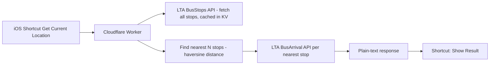

# SG Bus Nearest 🚌

One-tap nearest-bus-stop arrival times for Singapore, wired up as a 4-step iOS Shortcut.

No stop-picking menus. No confirmation dialogs. No local file dependencies.
Tap the Shortcut → it locates you → it tells you what's coming and when.

## Why this exists

Singapore's official [LTA DataMall](https://datamall.lta.gov.sg) API is great for looking up
arrival times at a bus stop you already know the code for — but it has **no "find stops near
this coordinate" endpoint**. `BusStops` only supports paging through the full ~5,000+ stop list;
`BusArrival` only accepts a known `BusStopCode`. There is no radius/lat-lng filter anywhere in
the current API surface.

So "what bus is coming, near me, right now" — the one query everyone actually wants — has to be
built on top, client-side or server-side. This repo does it server-side, so the phone-side
Shortcut can stay dead simple.

## How it works



1. The Shortcut grabs your current GPS location — that's it, that's the entire client-side logic.
2. The Worker fetches (or reads from cache) the full LTA bus stop list, computes distance from
   your location to every stop, and keeps the nearest few (covers both directions of a road by
   default).
3. It queries live arrival times for those stops and returns one clean plain-text block.
4. The Shortcut displays it. No parsing, no menus, no taps beyond the initial one.

## Features

- **Zero-selection UX** — no "which stop did you mean" prompts
- **No local storage / Files dependency** — nothing breaks if iCloud Drive or Face ID locks get
  in the way (this was the actual motivation for building this — other Shortcuts out there that
  rely on cached local files can repeatedly hit permission prompts)
- **KV-backed caching** — the ~5,000-stop list is cached for 7 days (coordinates rarely change),
  so most requests skip the expensive full re-fetch
- **Shared-secret access token** — the endpoint isn't wide open to anyone who finds the URL
- **Per-customer tokens (optional)** — to sell or hand out access: each token has its own expiry,
  daily request limit and usage stats, and can be renewed, revoked or replaced on its own. Stripe
  payments can issue and renew them automatically. See [Selling access](#selling-access)
- **Single file, no build step** — deploy straight from the Cloudflare dashboard, no `npm install`
  required (though a `wrangler.toml` is included if you prefer the CLI)

## Deploy

You'll need a free [LTA DataMall](https://datamall.lta.gov.sg/content/datamall/en/request-for-api.html)
API key (an Account Key, emailed to you after registering) and a free
[Cloudflare](https://dash.cloudflare.com) account.

### Option A — Dashboard (no CLI, ~5 minutes)

1. Cloudflare dashboard → **Workers & Pages** → **Create application** → **Start with Hello
   World!** → Deploy
2. Click **Edit code**, select all, replace with the contents of
   [`worker/bus-nearest-worker.js`](./worker/bus-nearest-worker.js), then **Deploy**
3. Worker → **Settings → Variables and Secrets** → add:
   - `LTA_API_KEY` (Secret) — your LTA Account Key
   - `ACCESS_TOKEN` (Secret) — any string you make up; this gates the endpoint
4. (Recommended) Enable caching — see [Caching](#caching) below
5. Copy your Worker URL, e.g. `https://your-worker.your-subdomain.workers.dev`

### Option B — Wrangler CLI

```bash
npm install -g wrangler
wrangler login
wrangler secret put LTA_API_KEY
wrangler secret put ACCESS_TOKEN
wrangler deploy
```

Edit `wrangler.toml` first if you already have a Worker deployed via the dashboard and want to
manage it from the CLI instead — set `name` to match your existing Worker's name so this updates
it in place rather than creating a duplicate.

### Caching

Bus stop coordinates barely ever change, so re-fetching all ~5,000 of them on every single
request is wasteful. Enable KV caching:

1. Dashboard → **Workers & Pages → KV** → **Create a namespace** (e.g. `bus-stops-cache`)
2. Your Worker → **Settings → Bindings → Add binding → KV Namespace** — variable name
   `BUS_STOPS_KV`, bind it to the namespace you just created
3. Redeploy

Cached data expires automatically after 7 days. To force a refresh sooner, call the endpoint with
`&refresh=1`.

This binding is optional — the Worker falls back to a live fetch every request if it's absent, so
nothing breaks if you skip this step.

Only a complete stop list is cached: LTA pages are fetched at most 4 at a time and retried, and if
one still fails the list serves that request but isn't stored.


## Selling access

`ACCESS_TOKEN` is one shared secret — fine for yourself, but anyone you give it to has it forever.
To hand out access per customer, add a D1 database:

1. Create the database and its table:

   ```bash
   wrangler d1 create sg-bus-nearest --location apac
   # paste the database_id it prints into wrangler.toml ([[d1_databases]], binding = "DB")
   wrangler d1 migrations apply sg-bus-nearest --remote
   ```

   Dashboard instead: **Storage & Databases → D1 → Create**, paste
   [`migrations/0001_create_tokens.sql`](./migrations/0001_create_tokens.sql) into the database's
   **Console**, then bind it to the Worker as `DB` under **Settings → Bindings**.
2. Add a secret `ADMIN_SECRET` — a long random string. It unlocks the admin API below.
3. Optional: add a plain variable `RENEW_URL` — your payment link, shown to customers whose pass has
   expired or expires within 3 days.
4. Redeploy.

Your own `ACCESS_TOKEN` keeps working as before, with no expiry or limit.

### What a token carries

| Setting | Meaning |
| --- | --- |
| `plan` | `free` / `trial` / `monthly` / `yearly` / `lifetime`. Sets the default length and daily limit (`PLANS` at the top of the worker); both can be overridden per token |
| `expiresAt` | When it stops working. `null` = never |
| `startOnFirstUse` | For codes handed out ahead of time (promos, gifts): the days start counting at the first request instead of at issue |
| `dailyLimit` | Max requests per Singapore calendar day, reset at midnight SGT. `null` = unlimited. Caps your cost and makes one token shared among many people impractical. Every request counts, including the HTML view's 30-second auto-refresh |
| `status` | `active` or `revoked` |
| `customer`, `note` | Free text for your records, e.g. email and payment reference |

The admin API also reports each token's `state` (`active` / `unused` / `expired` / `revoked`),
`usedToday`, `totalRequests`, `firstUsedAt` and `lastUsedAt` — handy for support and for spotting
a token that's being shared.

Tokens look like `sgb_` followed by 32 random characters. Only a SHA-256 hash is stored, so a leaked
database doesn't leak working tokens. A lost token therefore can't be looked up again, only replaced
with `rotate`.

### Admin API

Every call needs `Authorization: Bearer <ADMIN_SECRET>`. With `ADMIN_SECRET` unset, `/admin/*`
returns `404`.

```bash
W=https://your-worker.your-subdomain.workers.dev
A="Authorization: Bearer $ADMIN_SECRET"

# Issue — the token is only ever shown in this response
curl -X POST $W/admin/tokens -H "$A" -d '{"plan":"monthly","customer":"alice@example.com"}'
# Trial code whose 7 days start on first use
curl -X POST $W/admin/tokens -H "$A" -d '{"plan":"trial","startOnFirstUse":true}'
# Override the plan defaults
curl -X POST $W/admin/tokens -H "$A" -d '{"plan":"yearly","days":400,"dailyLimit":500}'

# Look up one, or list (newest first, optional ?customer= and ?limit=)
curl $W/admin/tokens/tk_abcd2345 -H "$A"
curl "$W/admin/tokens?customer=alice@example.com" -H "$A"

# Renew: adds the days to the current expiry, or to now if it already expired.
# The customer keeps the same token — nothing to change in their Shortcut.
curl -X POST $W/admin/tokens/tk_abcd2345/extend -H "$A" -d '{"days":31}'

# Revoke or reactivate, change the limit, or set an exact expiry
curl -X PATCH $W/admin/tokens/tk_abcd2345 -H "$A" -d '{"status":"revoked"}'
curl -X PATCH $W/admin/tokens/tk_abcd2345 -H "$A" -d '{"dailyLimit":100,"expiresAt":"2027-01-01T00:00:00+08:00"}'

# Replace a leaked or shared token: new token, same expiry and history; the old one stops at once
curl -X POST $W/admin/tokens/tk_abcd2345/rotate -H "$A"
```

### What customers see

| Situation | Status | Message |
| --- | --- | --- |
| Unknown token | `401` | Invalid access token. Check the token in your Shortcut. |
| Revoked | `403` | This access token has been disabled. |
| Expired | `402` | Your pass expired on 7 Nov 2026. + renew link |
| Over the daily limit | `429` | Daily limit of 300 requests reached. It resets at midnight (SGT). |
| Expires within 3 days | `200` | A ⚠️ line above the arrivals, with the renew link |

With `format=html` these show as a styled page; with `format=json` as `{ "error", "renewUrl" }`.
JSON responses for customer tokens also include `pass` (plan, expiry, daily limit, used today).

See [Sharing the Shortcut](./docs/ios-shortcut-setup.md#sharing-the-shortcut-with-customers) for
handing the Shortcut out so each customer pastes in their own token.

### Website

Once `DB` is bound, the Worker also serves the customer-facing site:

| Path | Page |
| --- | --- |
| `/` (no `lat`/`token`) | Landing page: what it does, a live-looking demo, how it works, pricing |
| `POST /free` | "Get free pass" button: issues a `free` pass (30 days, 4 checks a day) and shows the token once |
| `/welcome` | After a Stripe payment: the customer's token (see below) |
| `/privacy`, `/terms` | Privacy policy and terms — templates, have them reviewed before launch |

Product name, currency, prices and the launch-offer end date are constants at the top of the
worker (`PRODUCT_NAME`, `PAID_PLANS`, `PROMO_ENDS_AT`). Prices there are only what the page shows;
customers pay whatever their Payment Link charges. Until `PROMO_ENDS_AT` the page shows the launch
prices and uses the `*_PROMO` links; afterwards it switches to the regular ones by itself.

| Variable | Used for |
| --- | --- |
| `PAYMENT_LINK_MONTHLY`, `PAYMENT_LINK_YEARLY` | Subscribe buttons at regular prices |
| `PAYMENT_LINK_MONTHLY_PROMO`, `PAYMENT_LINK_YEARLY_PROMO` | Subscribe buttons during the launch offer |
| `MANAGE_URL` | "Manage subscription" link — your Stripe customer portal login link |
| `SUPPORT_EMAIL` | Contact link and the address in the privacy policy and terms |
| `SHORTCUT_URL` | "Add the Shortcut" link on the token pages |
| `RENEW_URL` | Where expired and free passes are sent; defaults to the pricing section |

A plan without a Payment Link shows "Coming soon". Free passes are limited to 3 per network per
day, using a one-way hash that changes daily rather than storing IP addresses (migration
[`0003`](./migrations/0003_free_signups.sql)). The free pass's HTML view doesn't auto-refresh, so it
doesn't burn its 4 daily checks.

Keep the launch price for launch subscribers: create the launch prices as separate Stripe prices
(not a coupon that expires); subscriptions stay on the price they started with, which is what the
page promises.

### Selling with Stripe

With this set up, a customer pays through a Stripe Payment Link, lands on a page showing their new
token and a link to add the Shortcut, and is set up — no manual step on your side. Subscriptions
keep their token valid for as long as they're paid.

1. Run the migrations again (`wrangler d1 migrations apply sg-bus-nearest --remote`) — or paste
   each file in [`migrations/`](./migrations) into the D1 Console, in order, each once.
2. In Stripe, create a Payment Link per product: a one-off price for passes, or a recurring price
   for subscriptions.
3. Give each Payment Link a `plan` **metadata** entry: `trial`, `monthly`, `yearly` or `lifetime`.
   Stripe copies it onto every purchase, so customers can't swap in a different plan. Optional
   `days` and `daily_limit` entries override the plan's defaults, e.g. `plan=monthly` + `days=92` for
   a 3-month pass. If the Payment Link editor doesn't offer metadata, set it through the API:

   ```bash
   curl https://api.stripe.com/v1/payment_links/plink_XXXX -u "sk_live_XXXX:" -d "metadata[plan]=monthly"
   ```

4. On each Payment Link's **Confirmation page** tab, choose **Don't show confirmation page** and
   redirect to:

   ```
   https://your-worker.your-subdomain.workers.dev/welcome?session_id={CHECKOUT_SESSION_ID}
   ```

5. **Developers → Webhooks → Add endpoint**: URL `https://your-worker…/stripe/webhook`, events
   `checkout.session.completed`, `checkout.session.async_payment_succeeded`, `invoice.paid` and
   `customer.subscription.deleted`. Save its signing secret as the Worker secret
   `STRIPE_WEBHOOK_SECRET`.
6. Optional variables: `SHORTCUT_URL` — the iCloud link of your shared Shortcut, shown on the welcome
   page; `RENEW_URL` — point it at your Payment Link.

How purchases map onto tokens:

| Stripe event | What happens |
| --- | --- |
| Checkout completed and paid | Token issued with the plan from metadata, the customer's email in `customer` |
| Checkout completed, payment still pending (delayed methods) | Nothing until `checkout.session.async_payment_succeeded` |
| `invoice.paid` on a subscription | Expiry moves to the end of the paid period + 2 days' grace — never earlier |
| Renewal payment fails | Nothing; the token runs out at the end of the grace period, and works again if a later payment succeeds |
| `customer.subscription.deleted` | Expiry pulled in to the moment the subscription ended (period end, or immediately) |
| Refund or dispute | Not automatic — revoke the token with the admin API |

Every handler is safe against Stripe's retries and out-of-order delivery. If a paid session has no
valid `plan` metadata, the webhook answers `400` so it shows up as a failed delivery in Stripe;
issue that customer's token by hand with the admin API.

The welcome page derives the token from the Checkout session id and `STRIPE_WEBHOOK_SECRET`, so the
customer can reopen it if they lose the token, while the database still only holds a hash. Two
consequences: anyone with the welcome link can see that token, and after you roll the webhook
signing secret, older welcome links can no longer show their token (the tokens keep working). A
token replaced with `rotate` is no longer shown either. Purchases made in Stripe test mode get the
note `Stripe test mode`.

## API

```
GET /?lat={latitude}&lon={longitude}&token={your ACCESS_TOKEN or a customer token}
```

The token can also be sent as an `Authorization: Bearer` header.

Optional:

- `&format=html` — a styled, dark-mode-aware page (stop cards, colour-coded crowding, auto-refresh
  every 30s). Open it with the Shortcut's **Show Web Page** action.
- `&format=json` — the same data as structured JSON, for building your own front end.
- `&refresh=1` — bypass the stop-list cache for this request. Owner token only.

By default it returns `text/plain`: nearest stops first, one line per bus service (sorted 49, 98,
98M, 154…), the next three arrivals in minutes, each prefixed with a crowding dot. Example:

```
🚏 Lakeside Stn · 28091 · 90m
49   🟢8 · 🟢26 · 🟡38 min
98M   🟢36 min
180   🔴Now · 🟡12 · 🟢14 min

🚏 Opp Blk 515 & 516 · 28389 · 260m
No arrival info

🟢 Seats  🟡 Standing  🔴 Full
```

`400` if `lat`/`lon` are missing or invalid. `401` / `402` / `403` / `429` for token problems —
see [What customers see](#what-customers-see). `502` if the stop list couldn't be loaded (usually a
bad or missing `LTA_API_KEY`).

## iOS Shortcut setup

See [`docs/ios-shortcut-setup.md`](./docs/ios-shortcut-setup.md) for the full step-by-step guide.

## Known limitations / possible next steps

- Nearest stops are picked purely by straight-line distance (currently top 3, `NEAREST_STOPS`, to
  reasonably cover both directions of a road). There's no reliable, documented pattern in LTA's bus stop codes for
  identifying "the stop across the road" directly — distance is the sturdiest general approach
  available.
- Customer tokens have daily limits, but requests with made-up tokens aren't throttled (each costs
  one D1 lookup). Add a Cloudflare Rate Limiting Rule if the endpoint ever gets hammered.
- Stripe refunds and disputes don't revoke tokens automatically — use the admin API.

## Tests

`node --test` — Node 22+, nothing to install. Covers the output formats against mocked LTA
responses, and the customer-token lifecycle, Stripe webhooks and website against a local SQLite
stand-in for D1.

## License

MIT — see [LICENSE](./LICENSE).
