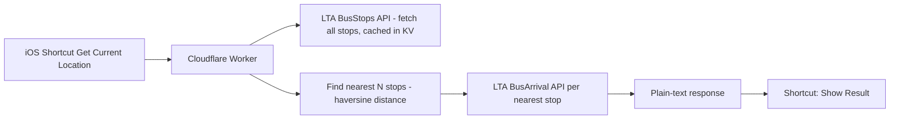

# SG Bus Nearest 🚌

One-tap nearest-bus-stop arrival times for Singapore, wired up as a 4-step iOS Shortcut.

No stop-picking menus. No confirmation dialogs. No local file dependencies.
Tap the Shortcut → it locates you → it tells you what's coming and when.

## Why this exists

Singapore's official [LTA DataMall](https://datamall.lta.gov.sg) API is great for looking up
arrival times at a bus stop you already know the code for — but it has **no "find stops near
this coordinate" endpoint**. `BusStops` only supports paging through the full ~5,000+ stop list;
`BusArrival` only accepts a known `BusStopCode`. There is no radius/lat-lng filter anywhere in
the current API surface.

So "what bus is coming, near me, right now" — the one query everyone actually wants — has to be
built on top, client-side or server-side. This repo does it server-side, so the phone-side
Shortcut can stay dead simple.

## How it works



1. The Shortcut grabs your current GPS location — that's it, that's the entire client-side logic.
2. The Worker fetches (or reads from cache) the full LTA bus stop list, computes distance from
   your location to every stop, and keeps the nearest few (covers both directions of a road by
   default).
3. It queries live arrival times for those stops and returns one clean plain-text block.
4. The Shortcut displays it. No parsing, no menus, no taps beyond the initial one.

## Features

- **Zero-selection UX** — no "which stop did you mean" prompts
- **No local storage / Files dependency** — nothing breaks if iCloud Drive or Face ID locks get
  in the way (this was the actual motivation for building this — other Shortcuts out there that
  rely on cached local files can repeatedly hit permission prompts)
- **KV-backed caching** — the ~5,000-stop list is cached for 7 days (coordinates rarely change),
  so most requests skip the expensive full re-fetch
- **Shared-secret access token** — the endpoint isn't wide open to anyone who finds the URL
- **Single file, no build step** — deploy straight from the Cloudflare dashboard, no `npm install`
  required (though a `wrangler.toml` is included if you prefer the CLI)

## Deploy

You'll need a free [LTA DataMall](https://datamall.lta.gov.sg/content/datamall/en/request-for-api.html)
API key (an Account Key, emailed to you after registering) and a free
[Cloudflare](https://dash.cloudflare.com) account.

### Option A — Dashboard (no CLI, ~5 minutes)

1. Cloudflare dashboard → **Workers & Pages** → **Create application** → **Start with Hello
   World!** → Deploy
2. Click **Edit code**, select all, replace with the contents of
   [`worker/bus-nearest-worker.js`](./worker/bus-nearest-worker.js), then **Deploy**
3. Worker → **Settings → Variables and Secrets** → add:
   - `LTA_API_KEY` (Secret) — your LTA Account Key
   - `ACCESS_TOKEN` (Secret) — any string you make up; this gates the endpoint
4. (Recommended) Enable caching — see [Caching](#caching) below
5. Copy your Worker URL, e.g. `https://your-worker.your-subdomain.workers.dev`

### Option B — Wrangler CLI

```bash
npm install -g wrangler
wrangler login
wrangler secret put LTA_API_KEY
wrangler secret put ACCESS_TOKEN
wrangler deploy
```

Edit `wrangler.toml` first if you already have a Worker deployed via the dashboard and want to
manage it from the CLI instead — set `name` to match your existing Worker's name so this updates
it in place rather than creating a duplicate.

### Caching

Bus stop coordinates barely ever change, so re-fetching all ~5,000 of them on every single
request is wasteful. Enable KV caching:

1. Dashboard → **Workers & Pages → KV** → **Create a namespace** (e.g. `bus-stops-cache`)
2. Your Worker → **Settings → Bindings → Add binding → KV Namespace** — variable name
   `BUS_STOPS_KV`, bind it to the namespace you just created
3. Redeploy

Cached data expires automatically after 7 days. To force a refresh sooner, call the endpoint with
`&refresh=1`.

This binding is optional — the Worker falls back to a live fetch every request if it's absent, so
nothing breaks if you skip this step.

## API

```
GET /?lat={latitude}&lon={longitude}&token={your ACCESS_TOKEN}
```

Optional:

- `&format=html` — a styled, dark-mode-aware page (stop cards, colour-coded crowding, auto-refresh
  every 30s). Open it with the Shortcut's **Show Web Page** action.
- `&format=json` — the same data as structured JSON, for building your own front end.
- `&refresh=1` — bypass the stop-list cache for this request.

By default it returns `text/plain`: nearest stops first, one line per bus service (sorted 49, 98,
98M, 154…), the next three arrivals in minutes, each prefixed with a crowding dot. Example:

```
🚏 Lakeside Stn · 28091 · 90m
49   🟢8 · 🟢26 · 🟡38 min
98M   🟢36 min
180   🔴Now · 🟡12 · 🟢14 min

🚏 Opp Blk 515 & 516 · 28389 · 260m
No arrival info

🟢 Seats  🟡 Standing  🔴 Full
```

`401` if the token doesn't match. `400` if `lat`/`lon` are missing or invalid. `502` if the stop
list couldn't be loaded (usually a bad or missing `LTA_API_KEY`).

## iOS Shortcut setup

See [`docs/ios-shortcut-setup.md`](./docs/ios-shortcut-setup.md) for the full step-by-step guide.

## Known limitations / possible next steps

- Nearest stops are picked purely by straight-line distance (currently top 4, to reasonably cover
  both directions of a road). There's no reliable, documented pattern in LTA's bus stop codes for
  identifying "the stop across the road" directly — distance is the sturdiest general approach
  available.
- No built-in rate limiting beyond the access-token gate. Cloudflare's dashboard-level Rate
  Limiting Rules (or a simple KV-based counter) would be a reasonable addition if this endpoint
  is ever exposed more broadly.

## License

MIT — see [LICENSE](./LICENSE).
